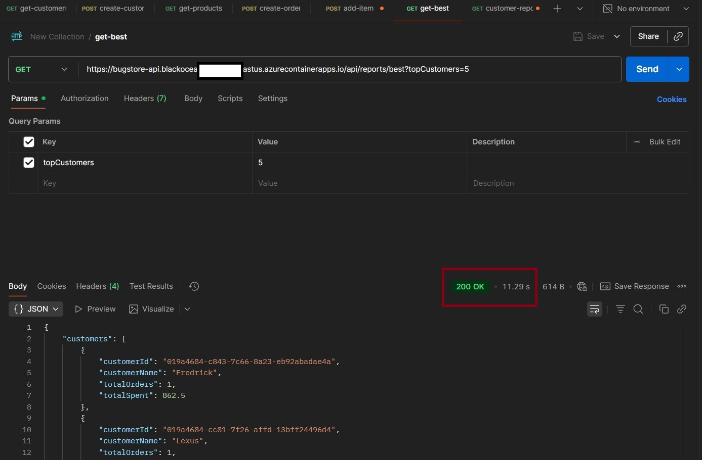
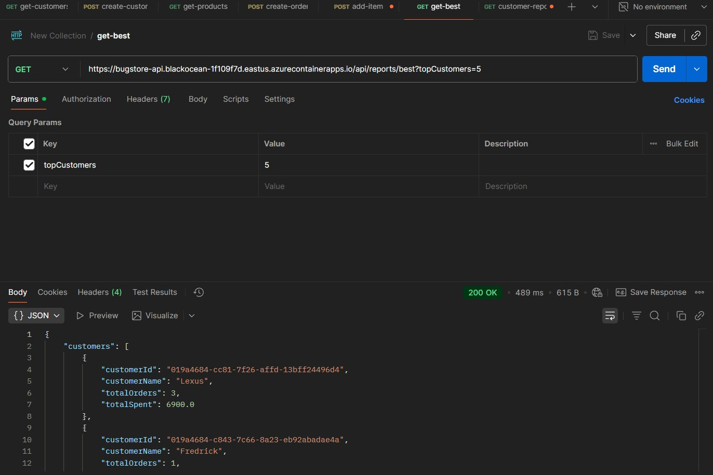

## 👻 Caça aos Bugs 2025 - Desafio 09 - Vecna

Oi, eu sou o Bruno e este é o espaço onde compartilho minha jornada de aprendizado durante o desafio **Caça aos Bugs 2025**, realizado pelo [balta.io](https://balta.io). 👻

Aqui você vai encontrar projetos, exercícios e códigos que estou desenvolvendo durante o desafio. O objetivo é colocar a mão na massa, testar ideias e registrar minha evolução no mundo da tecnologia.

### Sobre este desafio

No desafio **Vecna** eu tive que otimizar a performance da aplicação.
Neste processo eu aprendi:

-   ✅ Boas Práticas
-   ✅ Cache
-   ✅ Performance

## REGRAS DO DESAFIO

-   [x] Realizar um fork do repositório do desafio
-   [x] [Fazer o download do banco de testes](https://baltaio.blob.core.windows.net/temp/desafio-caca-aos-bugs-2025/database.zip)
-   [x] Otimizar os métodos (principalmente os de leitura)
-   [ ] Obter uma resposta de leitura em menos de 200ms (com cache habilitado) (500ms)

---

# DESAFIO CONCLUÍDO ✅

## Implementações

-   Arquitetura Clean Architecture com **CQRS**
-   Dapper para consultas de relatórios otimizadas
-   Índices básicos no banco (CustomerId, OrderId, ProductId)
-   Paginação nos endpoints de listagem
-   `AsNoTracking()` em consultas de leitura
-   Separação de repositórios Read/Write
-   Cache com Redis nos enpoints de relatórios

## Resultados de performance

-   Primeira chamada sem cache (baseline): **~11.29s**
-   Chamada subsequente com cache habilitado: **~489ms**




## Estrutura dos projetos

```
src/
├── BugStore.API — controla rotas e configuração da API
├── BugStore.Application — casos de uso (CQRS), DTOs e validações
├── BugStore.Domain — entidades e interfaces do domínio
├── BugStore.Infra — persistência (EF Core/Dapper), repositórios e serviços
└── BugStore.Exception — exceções e mensagens padronizadas

test/
├── BugStore.Application.Tests — testes da camada de aplicação
├── BugStore.Domain.Tests — testes das entidades e regras de domínio
├── BugStore.Infra.Tests — testes de infraestrutura e repositórios
└── BugStore.TestUtilities — builders e utilitários de testes
```

### 🚀 Deploy

-   Hospedagem: **Azure Container Apps**
-   Pipeline: **GitHub Actions**
-   Imagem: build + push para **Azure Container Registry (ACR)**
-   Atualização: `az containerapp update` com imagem e variáveis de ambiente
-   Segredos: configurados em **GitHub Actions Secrets** (`AZURE_*`, `DATABASE_URL`)
-   banco de dados postegres em `neon.com`
-   cache com redis em `upstash.com`

### 🔄 Fluxo do Pipeline

-   Em `push` ou `pull request` para `main`:
    -   Executa build e testes
    -   Se aprovado, faz build da imagem, push para o ACR e deploy no Azure Container Apps

## 🏗️ Arquitetura e Tecnologias

### **Padrões Arquiteturais**

-   **Clean Architecture** - Separação em camadas bem definidas
-   **CQRS** - Command Query Responsibility Segregation
-   **Mediator Pattern** - Desacoplamento entre componentes
-   **Domain-Driven Design** - Domínio rico com regras de negócio

### **Tecnologias Utilizadas**

-   **ASP.NET Core 9** - Framework web
-   **Entity Framework Core** - ORM e migrations
-   **Dapper** - Sql para consultas complexas
-   **PostgreSQL** - Banco de dados relacional
-   **Swagger/OpenAPI** - Documentação da API
-   **FluentValidation** - Validação de dados
-   **xUnit + Moq** - Testes unitários
-   **Bogus** - Geração de dados fake para testes
-   **SQLite In-Memory** - Testes de integração

### **Qualidade de Código**

-   **Tratamento Global de Exceções** - Filter customizado
-   **Exceções Customizadas** - Tipos específicos de erro
-   **Cobertura de Testes** - 138/138 testes passando (100%)

### Veja meu progresso no desafio

🔗 [Repositório central dos desafios](https://github.com/b01tech/balta-desafio-caca-aos-bugs-2025.git)
